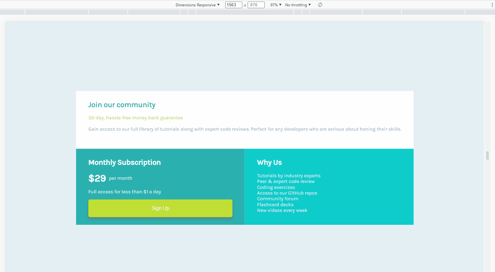

# Single Price Grid Component with HTML & CSS

This is a solution to the [Frontent Mentor](https://www.frontendmentor.io) Single Price Grid challenge. Frontend Mentor provides frontend designs that helps improve coding skills by building realistic projects.

### The challenge

- Build out the project to the designs provided.

### Links

- [Click to play with the Live site](https://jcsmileyjr.github.io/Single-price-grid/)
- [Coming Soon](https://dev.to/jcsmileyjr/frontend-challenge-12-time-tracking-dashboard-jdc)

### Built with

- Semantic HTML5 markup
- CSS custom properties
- CSS Grid
- Mobile-first workflow

## Author

- Website - [JC Smiley](https://www.jcsmileyjr.com)
- Frontend Mentor - [@jcsmileyjr](https://www.frontendmentor.io/profile/jcsmileyjr)
- Twitter - [@JCSmiley4](https://twitter.com/JCSmiley4)